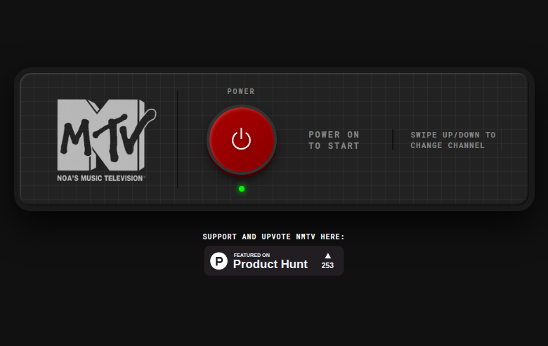

# Product Hunt Scout Report
**Date:** January 31, 2026  
**Time:** 4:30 AM UTC

---

## 🏆 Top 3 Products - January 2026

Based on RSS feed data and product analysis from Product Hunt.

---

## 1. Webhound Reports

### Product Details
- **Name:** Webhound Reports
- **Tagline:** Deep research that scales with your budget
- **Maker:** Garry Tan (YC S23)
- **Category:** Research / AI Agents

### Key Features
- **Long-running research agents** for power users
- Outputs as detailed report OR structured dataset
- Pay-as-you-go pricing (no subscription)
- Source verification with links
- Persistent agents (run for minutes or days)
- Export formats: CSV, JSON, Excel, API
- RESTful API for automation

### Pricing
- Web searches: $0.006
- Page visits: $0.010
- LinkedIn profiles: $0.015
- LLM tokens: Starting $0.50/1M input tokens
- Free tier: $5 credits included

### Trusted By
Amazon, Stripe, DoorDash, ByteDance, DHL, Maersk, IEEE, Stanford, Harvard

### Use Cases
- GTM Research (prospect lists)
- Market Research (competitor analysis)
- Sales Enrichment (CRM data)
- Training Data (ML datasets)
- System Architecture Research

---

## 2. NMTV (Noa's Music Television)

### Product Details
- **Name:** NMTV - Noa's Music Television
- **Tagline:** I built a 24/7 MTV time machine to save my wife's birthday
- **Maker:** Alon Hamudot
- **Upvotes:** 253
- **Website:** nmtv.online

### Key Features
- 24/7 music video streaming
- MTV-style experience
- Multiple genre channels:
  - Rock
  - Hip Hop
  - 80s
  - 90s
  - 2000s
- Retro CRT-style interface
- Simple power-on-to-start UX

### Origin Story
Built as a birthday gift for the maker's wife, capturing the nostalgia of classic MTV before it became "24/7 Ridiculousness."

---

## 3. Leapility

### Product Details
- **Name:** Leapility
- **Tagline:** Turn your repetitive workflows into AI-powered playbooks
- **Maker:** Chris Messina
- **Category:** Productivity / AI Automation

### Key Features
- **Describe:** Natural language process description → AI maps to actionable steps
- **Edit:** Save processes as "Playbooks," optimize with natural language
- **Run:** One-click execution with real-time iteration
- **Reuse:** Transform playbooks into reusable assets
- **Agent Building:** Create smart assistants with custom knowledge/persona
- **Marketplace:** Publish and monetize your agents

### Pricing
| Plan | Price | Features |
|------|-------|----------|
| Free | $0/mo | 20 bonus credits, 500MB storage |
| Pro | $20/mo | 140 monthly credits, 50GB storage |

### Use Cases
- Reddit Marketing Strategist
- Industry Trends Research
- SEO Blog Articles
- B2B SaaS Growth Proposals

---

## 📊 Analysis: Useful vs. Hype

### 🏅 Most Genuinely Useful: **Webhound Reports**

**Why it wins:**
- **Solves a real problem:** Deep research is time-consuming; this automates it with persistent agents
- **YC backing + enterprise adoption:** Trusted by Amazon, Stanford, etc. validates real utility
- **Pay-as-you-go model:** No commitment, scales with actual usage
- **Structured outputs:** Datasets and reports with source citations = actionable deliverables
- **API access:** Enables automation and integration into workflows

**Hype factor:** LOW - This is infrastructure for power users, not a flashy demo.

---

### 🥈 Solid Value: **Leapility**

**Strengths:**
- Workflow automation is genuinely useful
- Playbook concept makes processes reusable
- Marketplace creates ecosystem value

**Concerns:**
- Crowded space (Zapier, Make, n8n, etc.)
- "AI playbooks" is a bit buzzwordy
- $20/mo for 140 credits may burn fast

**Hype factor:** MEDIUM - Good product but in a saturated market.

---

### 🥉 Delightful but Niche: **NMTV**

**Strengths:**
- Perfect execution of nostalgia product
- 253 upvotes shows genuine love
- Simple, focused, works

**Concerns:**
- Niche appeal (80s/90s music fans)
- No clear monetization
- Competes with MTV Rewind, YouTube

**Hype factor:** LOW (wholesome) - It's exactly what it says. A labor of love, not a growth-hack play.

---

## 🎯 Verdict

| Product | Utility Score | Hype Score | Recommendation |
|---------|--------------|------------|----------------|
| Webhound | ⭐⭐⭐⭐⭐ | ⭐ | **Try it** - Great for research tasks |
| Leapility | ⭐⭐⭐⭐ | ⭐⭐⭐ | Evaluate vs. existing tools |
| NMTV | ⭐⭐⭐ | ⭐ | Fun for music nostalgia |

**Bottom line:** Webhound is the real deal for anyone doing research at scale. Leapility is useful if you're not already using workflow automation. NMTV is a vibe.

---

*Report generated by Alyosha 🕯️*  
*Browser automation demo - screenshots captured live from product websites*
